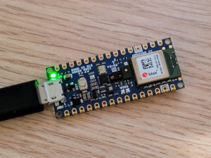
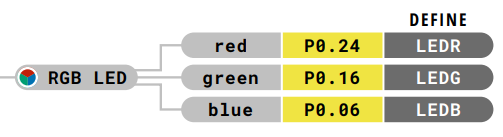
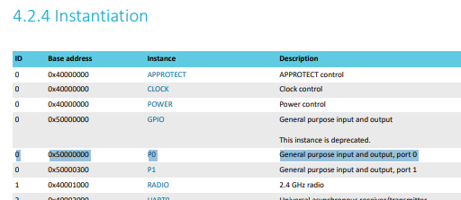

# The toolchain, or: An Exercise in Masochism

The microcontroller board I've chosen for this project is the
[Arduino Nano 33 BLE Sense Rev2][nano33ble2].

If I were a normal, sane person who had a healthy relationship with project
timelines, I'd use the Arduino SDK, with its built-in support for the
microcontroller and libraries for all the sensors I want to use. This'd let me
start writing useful code right away!

Unfortunately (for you), I like taking matters into my own hands.
There's a few reasons why I stepped right over using the Arduino SDK:

* I wanted to get some practice at using Rust for a real embedded software project.
* I expect my software will have to do some fairly heavy computation (for the 3D
  spatial stuff) on a fairly modest microcontroller - for which I'll want to have
  a lot of control over the compiler's code generation and the hardware drivers.
* I just enjoy playing with low-level stuff like this!

Fortunately there's already great support for writing embedded software in Rust!
Especially so for ARM Cortex-M microcontrollers like the one on the BLE Sense Rev2.
The [Embedded Rust Book][book] is a fantastic place to learn about the concepts.

## Part 1: Installing Rust with embedded support

The Arduino Nano 33 BLE Sense Rev2 board features a Nordic nRF52840 microcontroller,
which is built around an ARM Cortex-M4F processor core. We'll need to tell Rust
to compile code for this architecture instead of for the architecture the compiler
is running on (`x86_64`, most likely). Rust is able to do this out of the box,
but it doesn't ship with the necessary pre-compiled `core` crate. We'll need to
add this to our Rust installation.

If you're using Nix to manage development tools like me, this is easy to do with
[fenix][]. See [this commit][rust-nix-commit] where I define a customised Rust
toolchain (i.e. a Nix package with `cargo` and `rustc` executables) and add it
to my dev shell.

Otherwise, it's best to install Rust using [rustup][]; then installing the
pre-compiled `core` crate is a one-liner:

```shell
rustup target add thumbv7em-none-eabihf
```

`thumbv7em-none-eabihf` is Rust's name for the embedded ARM Cortex-M4F
architecture, as is used on the Arduino Nano 33 BLE Sense Rev2.

## Part 2: Creating a Rust crate for our project

I'll be leaning heavily on the industry-standard [`cortex-m`][cortex-m] crate
for this project. Not only does it provide an API for accessing standard Cortex-M
peripherals like SysTick, it also takes care of mapping our program onto the
specific processor's memory layout and initialising RAM at startup.

However, there are some elements of the setup that `cortex-m` can't encapsulate;
we'll need several additional config files beyond what exists in a typical Rust
crate. Fortunately there are project templates available!

The template that the `cortex-m` maintainers currently recommend for use is
[`knurling-rs/app-template`][knurling-template], but this contains a lot of
extra features that I won't need any time soon, like serial logging. Instead
I'll use [`cortex-m-quickstart`][cortex-m-quickstart] which is no longer
maintained but should still work fine, and is much closer to what I'm looking for.

I started by [copying the contents of `cortex-m-quickstart` into a new folder
in this repository][quickstart-commit], excluding things that obviously aren't
needed like the original README or the `examples` folder. Then I proceeded to:

* [update the crate name/metadata to be relevant to this project][crate-metadata-commit]
* [tell the Rust compiler which CPU to compile for][target-platform-commit]
* [tell the linker what the memory layout of our specific CPU is][memory-layout-commit]
* [update to the latest edition of Rust][rust-edition-commit], since the template
  is pretty outdated in this regard
* [remove the dependency on `cortex-m-semihosting`][semihosting-commit]
  (this provides facilities for logging over serial, which I don't plan to do
  any time soon)
* [remove commented-out code that isn't relevant to this project][cleanup-commit]
* [switch to using a Cargo workspace][workspace-commit], since I expect to break
  up this project into multiple crates

And then we're all set to compile the project for the first time!

```console
[kier@coloris:~/underglow/firmware]$ cargo build --release -p underglow-fw
   Compiling proc-macro2 v1.0.106
   Compiling semver-parser v0.7.0
   Compiling quote v1.0.44
   Compiling unicode-ident v1.0.24
   Compiling nb v1.1.0
   Compiling cortex-m v0.7.7
   Compiling semver v0.9.0
   Compiling cortex-m-rt v0.7.5
   Compiling nb v0.1.3
   Compiling vcell v0.1.3
   Compiling rustc_version v0.2.3
   Compiling void v1.0.2
   Compiling volatile-register v0.2.2
   Compiling embedded-hal v0.2.7
   Compiling bitfield v0.13.2
   Compiling bare-metal v0.2.5
   Compiling underglow-fw v0.1.0 (~/underglow/firmware/underglow-fw)
   Compiling critical-section v1.2.0
   Compiling panic-halt v1.0.0
   Compiling syn v2.0.117
   Compiling cortex-m-rt-macros v0.7.5
    Finished `release` profile [optimized + debuginfo] target(s) in 4.40s
```

We can see that cargo spat out an executable in the
`target/thumbv7em-none-eabihf/release` directory, and we can confirm that this
executable uses the ARM instruction set rather than x86_64:

```console
[kier@coloris:~/underglow/firmware]$ file target/thumbv7em-none-eabihf/release/underglow-fw
target/thumbv7em-none-eabihf/release/underglow-fw: ELF 32-bit LSB executable, ARM, EABI5 version 1 (SYSV), statically linked, with debug_info, not stripped
                                                       ^^^^^^                 ^^^
```

## Part 3: Uploading the program to the board

I figured I'd replicate what the Arduino framework does here.

I created a simple Arduino sketch, and compiled and uploaded it to my board
using the [Arduino CLI][arduino-cli]:

```console
[kier@coloris:~/tmp]$ arduino-cli sketch new throwaway
Sketch created in: /home/kier/tmp/throwaway

[kier@coloris:~/tmp]$ cd throwaway/

[kier@coloris:~/tmp/throwaway]$ cat throwaway.ino
void setup() {
}
void loop() {
}

[kier@coloris:~/tmp/throwaway]$ arduino-cli compile --fqbn arduino:mbed_nano:nano33ble
Sketch uses 85328 bytes (8%) of program storage space. Maximum is 983040 bytes.
Global variables use 44552 bytes (16%) of dynamic memory, leaving 217592 bytes for local variables. Maximum is 262144 bytes.

[kier@coloris:~/tmp/throwaway]$ arduino-cli upload --fqbn arduino:mbed_nano:nano33ble --port /dev/ttyACM0
Device       : nRF52840-QIAA
Version      : Arduino Bootloader (SAM-BA extended) 2.0 [Arduino:IKXYZ]
Address      : 0x0
Pages        : 256
Page Size    : 4096 bytes
Total Size   : 1024KB
Planes       : 1
Lock Regions : 0
Locked       : none
Security     : false
Erase flash

Done in 0.001 seconds
Write 85336 bytes to flash (21 pages)
[==============================] 100% (21/21 pages)
Done in 3.271 seconds
New upload port: /dev/ttyACM0 (serial)
```

85 kB for a program that does absolutely nothing! We can do better...

Anyway - `arduino-cli upload` is a unified wrapper around various low-level
commands that do the job of actually communicating with different types of
Arduino board, for example `avrdude`. I wanted to see if I could avoid a
dependency on the full Arduino stack and use this low-level command directly,
whatever it is.

To find out what the low-level command for a Nano 33 is, I ran `ps` to list
processes while `arduino-cli upload` was running in another tab:

```console
[kier@coloris:~/tmp/throwaway]$ ps afx | cat
...
  12980 pts/1    Sl+    0:00                  |           \_ arduino-cli upload --fqbn arduino:mbed_nano:nano33ble --port /dev/ttyACM0
  12988 pts/1    Sl     0:00                  |               \_ mdns-discovery
  12990 pts/1    Sl     0:00                  |               \_ serial-discovery
  13118 pts/1    S      0:00                  |               \_ bossac --port=ttyACM0 -U -i -e -w /home/kier/.cache/arduino/sketches/5D4E0A6B5EFF96EA22FE90CB74C56DEB/throwaway.ino.bin -R
...
```

The `bossac` subprocess looked like the interesting one - the naming of the
other two suggests they're not part of the actual upload process.

I installed [BOSSA][bossa] (the software package that provides this command)
and tried running it directly. This didn't work sadly...

```console
[kier@coloris:~/tmp/throwaway]$ bossac --port=ttyACM0 -U -i -e -w /home/kier/.cache/arduino/sketches/5D4E0A6B5EFF96EA22FE90CB74C56DEB/throwaway.ino.bin -R

SAM-BA operation failed
```

After poking at the various options for resetting the board and getting nowhere,
I noticed that the Arduino project has [its own fork of BOSSA][arduino-bossa],
with some customisations that are presumably needed for talking to Arduino
hardware. This makes sense since BOSSA itself is a generic, non-Arduino-specific
tool.

I [compiled the Arduino version of BOSSA from source][arduino-bossa-nix-commit]
and tried the upload again with it - and guess what!

```console
[kier@coloris:~/tmp/throwaway]$ bossac --port=ttyACM0 -U -i -e -w /home/kier/.cache/arduino/sketches/5D4E0A6B5EFF96EA22FE90CB74C56DEB/throwaway.ino.bin -R
Device       : nRF52840-QIAA
Version      : Arduino Bootloader (SAM-BA extended) 2.0 [Arduino:IKXYZ]
Address      : 0x0
Pages        : 256
Page Size    : 4096 bytes
Total Size   : 1024KB
Planes       : 1
Lock Regions : 0
Locked       : none
Security     : false
Erase flash

Done in 0.001 seconds
Write 85336 bytes to flash (21 pages)
[==============================] 100% (21/21 pages)
Done in 3.271 seconds
```

Arduino framework eliminated!

Now to try it with our real firmware. One thing to note is that the Rust compiler
emits our compiled firmware in ELF format, but `bossac` expects its input in raw
binary format (i.e. the exact bytes that need to be copied into the processor's
flash memory). We can do this conversion using `objcopy`:

```console
[kier@coloris:~/underglow/firmware]$ arm-none-eabi-objcopy -O binary target/thumbv7em-none-eabihf/release/underglow-fw underglow-fw.bin

[kier@coloris:~/underglow/firmware]$ file underglow-fw.bin
underglow-fw.bin: ARM Cortex-M firmware, initial SP at 0x20040000, reset at 0x00010400, NMI at 0x00010458, HardFault at 0x00010464, SVCall at 0x00010458, PendSV at 0x00010458

[kier@coloris:~/underglow/firmware]$ bossac --port=ttyACM0 -U -i -e -w underglow-fw.bin -R
Device       : nRF52840-QIAA
Version      : Arduino Bootloader (SAM-BA extended) 2.0 [Arduino:IKXYZ]
Address      : 0x0
Pages        : 256
Page Size    : 4096 bytes
Total Size   : 1024KB
Planes       : 1
Lock Regions : 0
Locked       : none
Security     : false
Erase flash

Done in 0.001 seconds
Write 1132 bytes to flash (1 pages)
[==============================] 100% (1/1 pages)
Done in 0.149 seconds
```

Yay! Our brand new firmware package is running on the real hardware!



...and doing very little of interest. Did it flash properly? How will we ever
know? The [`src/main.rs` that we got from the `cortex-m-quickstart`
template][quickstart-main] does nothing except go into an infinite loop - it doesn't
flash any lights or make any sounds. Next, let's write a more interesting
program so that we can tell if our compile & upload process works correctly.

## Part 4: A demo program that actually does something

The Nano 33 BLE series of boards have an onboard RGB LED. Let's make it flash
different colours in turn: red, green, blue, and back to red, looping forever,
spending about a second on each colour.

Let's go ahead and write some code to model this behaviour - we'll work out the
details of driving the hardware later. [See the code...][demo-app-logic-commit]

The LED is straightforward to drive - the red, green and blue channels are each
wired to their own GPIO pin on the microcontroller. If we want the LED to show
green, we set the green pin high and the red and blue pins low, etc.
[See the code...][demo-colour-mapping-commit]

Now to implement `GPIOPin::set_output_state`, we need to start looking at datasheets.
The [pinout document for the Nano 33 BLE Sense Rev2][nano33ble2-pinout] tells us
which microcontroller pin each colour channel is connected to:



Here, `P0.24` means the pin at position 24 within GPIO port 0.
[See the code...][demo-pin-index-commit]

Now it's time to work out which memory-mapped register(s) we need to write to in
order to set the pin states. Let's head to the microcontroller's
[datasheet][nrf52840-datasheet] and jump to the section for GPIO pins (§6.9.2).
These look like the ones we want - particularly `OUTSET` and `OUTCLR` since
they mean we can update a single pin's state in a single write operation instead
of a read-modify-write sequence.


`OUTSET` is located at offset 0x508 from the beginning of the register block
for GPIO port 0 (and `OUTCLR` at offset 0x50C). But where is this register
block? Its address can be found in §4.2.4 Instantiation, which lists every
instance of every peripheral and the address that its corresponding register
block begins at.



So we can deduce that `OUTSET` for GPIO port 0 lies at address 0x50000508 and
`OUTCLR` at 0x5000050C. [See the code...][demo-out-reg-addrs-commit]

How do we interact with a register in Rust? It's not as simple as just writing
to the pointer - the compiler needs to understand that it can't optimize away
seemingly-redundant writes to this memory location. In C, we'd mark the pointer
as `volatile`; the equivalent behaviour in Rust is neatly encapsulated by the
[`volatile-register`][volatile-register] crate.

`volatile-register` offers types for read-only, write-only and read-write
registers. `OUTSET` and `OUTCLR` are write-only 32-bit registers, so we'll use
`volatile_register::WO<u32>` to interact with them.
[See the code...][demo-vol-reg-commit].

More coming soon...

## Part 5: Tying this all together with Nix

Coming soon...

[arduino-bossa]: https://github.com/arduino/BOSSA
[arduino-bossa-nix-commit]: https://github.com/kierdavis/underglow/commit/029a1721892ca274452a6a8c064ecd212cb1cdd2
[arduino-cli]: https://docs.arduino.cc/arduino-cli/getting-started/
[book]: https://doc.rust-lang.org/beta/embedded-book/
[bossa]: https://github.com/shumatech/BOSSA
[cleanup-commit]: https://github.com/kierdavis/underglow/commit/49c7eb11c1705ca4df18305eb1155c52be4e96d8
[cortex-m]: https://crates.io/crates/cortex-m
[cortex-m-quickstart]: https://github.com/rust-embedded/cortex-m-quickstart/tree/ac02415275d0190a1a7aa730ec2b0bdf7c3ef88f
[crate-metadata-commit]: https://github.com/kierdavis/underglow/commit/5f029c0e43cbce34e5f0259bb4e3c75f97a7f4c5
[demo-app-logic-commit]: https://github.com/kierdavis/underglow/commit/b987a314b1a33e830740ba60e9de921cecf3ad11
[demo-colour-mapping-commit]: https://github.com/kierdavis/underglow/commit/bf711139ed267838113cb5a748c0e4f360d833c5
[demo-pin-index-commit]: https://github.com/kierdavis/underglow/commit/28b6906529a5176e2d6bfaddcc559f7b66fc05d0
[demo-out-reg-addrs-commit]: https://github.com/kierdavis/underglow/commit/f5838acf678c7056a555a6c3dcae62250404c88b
[demo-vol-reg-commit]: https://github.com/kierdavis/underglow/commit/226b1e91fb9e58f059b522465dd6a8a273c0f0b2
[fenix]: https://github.com/nix-community/fenix
[knurling-template]: https://github.com/knurling-rs/app-template
[memory-layout-commit]: https://github.com/kierdavis/underglow/commit/64135aa8e4deedc293c1cd67360de83a2da19175
[nano33ble2]: https://docs.arduino.cc/hardware/nano-33-ble-sense-rev2/
[nano33ble2-pinout]: https://docs.arduino.cc/resources/pinouts/ABX00069-full-pinout.pdf
[nrf52840-datasheet]: https://docs-be.nordicsemi.com/bundle/ps_nrf52840/attach/nRF52840_PS_v1.11.pdf?_LANG=enus
[quickstart-commit]: https://github.com/kierdavis/underglow/commit/9170d92bd875456be7652712e49946c1f01ec32c
[quickstart-main]: https://github.com/kierdavis/underglow/blob/9170d92bd875456be7652712e49946c1f01ec32c/firmware/underglow-fw/src/main.rs
[rustup]: https://rustup.rs/
[rust-edition-commit]: https://github.com/kierdavis/underglow/commit/02e7828f417eaeee5a3c6f25da7d9d38e9d10886
[rust-nix-commit]: https://github.com/kierdavis/underglow/commit/0303d142465da51cee1706e7fbdd3f690dccab28
[semihosting-commit]: https://github.com/kierdavis/underglow/commit/08be183c09fe008c20cc0571f3faedf40e5aee55
[target-platform-commit]: https://github.com/kierdavis/underglow/commit/8d0356ea12e54f0041bd9361d960050258da2386
[volatile-register]: https://crates.io/crates/volatile-register
[workspace-commit]: https://github.com/kierdavis/underglow/commit/18a1819da1c746650a45d34f274508fbe8081ca6
